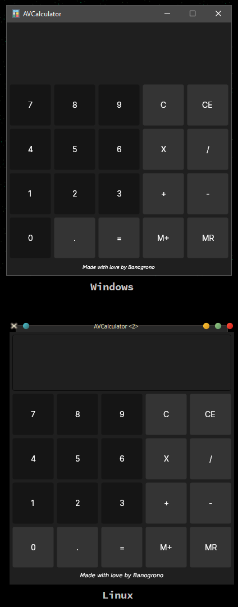

# AVCalculator

AVCalculator is a cross-patform desktop calculator made with Avalonia framework.
The point of this project is to learn Avalonia, advanced C# techniques and use MVC
pattern in practice. 

**[Discalmer] This is version 0.1** - it is very buggy and has no keyboard support;
it'll (hopefully) come in the later update.

## Screenshots

    </img>

  
## Features

- Cross platform
- Kinda works
- Looks decent 
- Supports Keyboard (including numpad!)

  
